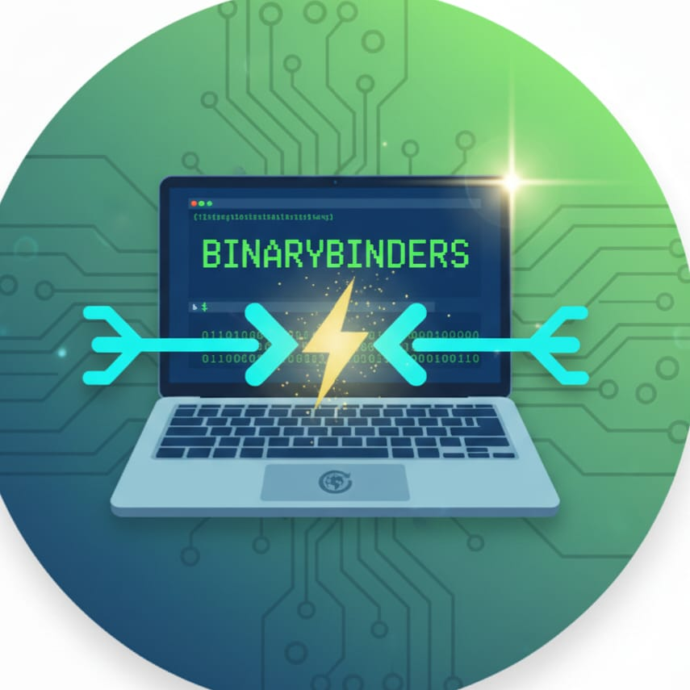

  

# ECO (Efficient Compressed Operations)

# ECO
🌐 ECO: Efficient Compressed Operations
Private, P2P file-sharing powered by bit-level compression for lightning-fast, serverless data exchange.

ECO (Efficient Compressed Operations):

⚡ One-Line Pitch
A privacy-first, Peer-to-Peer (P2P) file transfer utility that shrinks data using custom bit-level compression for ultra-fast, serverless sharing.

💎 Core Pillars
🔒 Zero-Knowledge Privacy
Unlike cloud services (Drive/Dropbox), ECO never "holds" your data. Files are streamed directly from the sender's RAM to the receiver's RAM. No middleman, no logs, no leaks.
📉 Ultra-Fast Transfer
By implementing a custom Huffman Coding algorithm in JavaScript, we compress text-heavy data (logs, code, JSON) locally before it enters the network. Smaller payloads = faster arrival.
🔌 True P2P "Binding"
Utilizing WebRTC Data Channels, we establish a direct encrypted "pipe" between two devices. Once the connection is "plugged in," the central server is completely bypassed.

🛠️ The BINARYBINDERS Edge (Technical Stack)

The Logic	🧠 Huffman Coding	Bit-level data optimization built from scratch (no standard libraries).

The Connection	🛰️ WebRTC	Direct browser-to-browser transport for zero-latency exchange.

The Interface	🎨 Tailwind CSS	A lightweight, professional UI focused on user experience.

🤝 Contributing
We welcome contributions! Please feel free to submit a Pull Request or report Issues to help make ECO even faster.